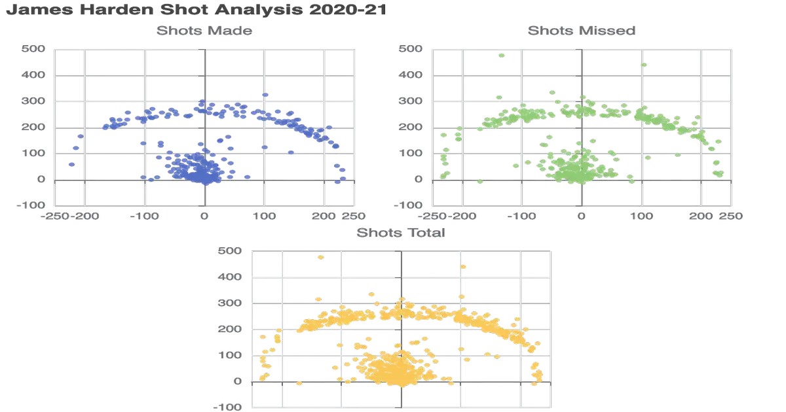

# :basketball: nba-sql

[]()

An application to build a Postgres, MySQL/MariaDB, or SQLite NBA database from the public API.

The latest Linux, MacOS, and Windows releases [can be found in the releases section.](https://github.com/mpope9/nba-sql/releases/tag/v0.1.0).

Here is an example query which can be used after building the database. Lets say we want to find Russell Westbrook's total Triple-Doubles:
```SQL
SELECT SUM(td3) 
FROM player_game_log 
LEFT JOIN player ON player.player_id = player_game_log.player_id 
WHERE player.player_name = 'Russell Westbrook';
```
Check the [wiki/Example-Queries](https://github.com/mpope9/nba-sql/wiki/Example-Queries) for more example queries.

Here is an example shot visualization using the `shot_chart_detail` table ([Apache ECharts](https://echarts.apache.org/en/index.html)):



The default behavior is to load the current season (or update if it already exists) into a SQLite database.

To load data into DuckDB, use the [SQLite Extension](https://duckdb.org/docs/extensions/sqlite.html) after creating a SQLite database.

# Getting Started

* [A good place for more information is the wiki](https://github.com/mpope9/nba-sql/wiki).
* [Looking to contribute? Check the list of open issues!](https://github.com/mpope9/nba-sql/issues)

The following environment variables _must_ be set. *There are no commandline arguments to specify these.* The following example are connection details for the provided docker-compose database:
```bash
DB_NAME="nba"
DB_HOST="localhost"
DB_USER="nba_sql"
DB_PASSWORD="nba_sql"
```

It will take an estimated 6 hours to build the whole database. However, some tables take much longer than others due to the amount of data: `play_by_play`, `shot_chart_detail`, and `pgtt` in particular. These can be skilled with the `--skip-tables` option. Most basic queries can use the `player_game_log` (which is unskippable).


## Commandline Reference
```
>python stats/nba_sql.py --help
usage: nba_sql.py [-h] [--database {mysql,postgres,sqlite}] [--database_name DATABASE_NAME] [--database_host DATABASE_HOST] [--username USERNAME] [--create-schema] [--time-between-requests REQUEST_GAP]
                  [--batch_size BATCH_SIZE] [--sqlite-path SQLITE_PATH] [--quiet] [--default-mode] [--current-season-mode] [--password PASSWORD]
                  [--seasons [{1997-98,1998-99,1999-00,2000-01,2001-02,2002-03,2003-04,2004-05,2005-06,2006-07,2007-08,2008-09,2009-10,2010-11,2011-12,2012-13,2013-14,2014-15,2015-16,2016-17,2017-18,2018-19,2019-20,2020-21,2021-22,2022-23,2023-24,2024-25} ...]]
                  [--skip-tables [{player_season,player_game_log,play_by_play,pgtt,shot_chart_detail,game,event_message_type,team,player,} ...]]

nba-sql

options:
  -h, --help            show this help message and exit
  --database {mysql,postgres,sqlite}
                        The database flag specifies which database protocol to use. Defaults to "sqlite", but also accepts "postgres" and "mysql".
  --database_name DATABASE_NAME
                        Database Name (Not Needed For SQLite)
  --database_host DATABASE_HOST
                        Database Hostname (Not Needed For SQLite)
  --username USERNAME   Database Username (Not Needed For SQLite)
  --create-schema       Flag to initialize the database schema before loading data. If the schema already exists then nothing will happen.
  --time-between-requests REQUEST_GAP
                        This flag exists to prevent rate limiting, and injects the desired amount of time inbetween requesting resources.
  --batch_size BATCH_SIZE
                        Inserts BATCH_SIZE chunks of rows to the database. This value is ignored when selecting database 'sqlite'.
  --sqlite-path SQLITE_PATH
                        Setting to define sqlite path.
  --quiet               Setting to define stdout logging level. If set, only "ok" will be printed if ran successfully. This currently only applies to refreshing a db, and not loading one.
  --default-mode        Mode to create the database and load historic data. Use this mode when creating a new database or when trying to load a specific season or a range of seasons.
  --current-season-mode
                        Mode to refresh the current season. Use this mode on an existing database to update it with the latest data.
  --password PASSWORD   Database Password (Not Needed For SQLite)
  --seasons [{1997-98,1998-99,1999-00,2000-01,2001-02,2002-03,2003-04,2004-05,2005-06,2006-07,2007-08,2008-09,2009-10,2010-11,2011-12,2012-13,2013-14,2014-15,2015-16,2016-17,2017-18,2018-19,2019-20,2020-21,2021-22,2022-23,2023-24,2024-25} ...]
                        The seasons flag loads the database with the specified season. The format of the season should be in the form "YYYY-YY". The default behavior is loading the current season.
  --skip-tables [{player_season,player_game_log,play_by_play,pgtt,shot_chart_detail,game,event_message_type,team,player,} ...]
                        Use this option to skip loading certain tables.
```

## :crystal_ball: Schema
#### Supported Tables
* player
* team
* game
* play_by_play
* player_game_log
* player_season
* team_game_log
* team_season
* player_general_traditional_total (Also referred to in short as pgtt)
* shot_chart_detail

An up-to-date ER diagram can be found in [`image/NBA-ER.jpg`](https://github.com/mpope9/nba-sql/blob/main/image/NBA-ER.jpg).


## :wrench: Building From Scratch

Requirements:

Python >= 3.8

### :scroll: Provided Scripts

In the `scripts` directory, we provide a way to create the schema and load the data for a Postgres database. We also provide a docker-compose setup for development and to preview the data.

```shell
# Required if you're on Debian based systems
sudo service postgresql stop

docker-compose -f docker/docker-compose-postgres.yml up -d

pip install -r requirements.txt

./scripts/create_postgres.sh
```

If you want to use MariaDB, start it with:
```
docker-compose -f docker/docker-compose-mariadb.yml up -d

./scripts/create_maria.sh
```

### :snake: Directly Calling Python

The entrypoint is `stats/nba_sql.py`. To see the available arguments, you can use:
```bash
python stats/nba_sql.py -h
```

To create the schema, use the `--create-schema`. Example:
```bash
pyhton stats/nba_sql.py --create-schema
```

To enable a Postgres database, use the `--database` flag. Example:
```bash
python stats/nba_sql.py --database="postgres"
```

We have added a half second delay between making requests to the NBA stats API. To configure the amount of time use the `--time-between-requests` flag.
```bash
python stats/nba_sql.py --time-between-requests=.5
```

The script `nba_sql.py` adds several tables into the database. Loading these tables takes time, notably, the `play_by_play` table. 
Some of these tables can be skipped by using the `--skip-tables` CLI option. Example:

```bash
python stats/nba_sql.py --create-schema --database postgres --skip-tables play_by_play pgtt
```

### :computer: Local development

#### Setup
Create your virtual environment if you don’t have one already. In this case we use `venv` as the target folder for storing packages.

`python -m venv venv`

Then activate it:
`source venv/bin/activate`

Install dependencies using:
`pip install -r requirements.txt`

Or if you don't want to install the GUI deps you can use:
`pip install -r requirements_no_gui.txt`

##### MacOS Errors

If you try to setup on MacOS and see an error like
```
Error: pg_config executable not found.
```

This can be resolved by installing `postgresql` through Homebrew:
```bash
brew install postgresql
```

# :pray: Acknowledgements
* [@avadhanij](https://github.com/avadhanij): For guidance and knowledge.
* [nba_api project](https://github.com/swar/nba_api): A great resource to reference for endpoint documentation.
* BurntSushi's [nfldb](https://github.com/BurntSushi/nfldb): The inspiration for this project.
